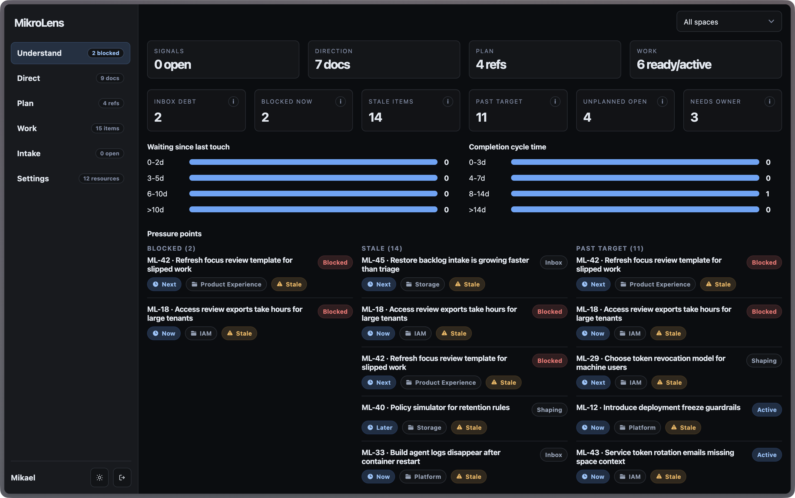

# MikroLens

**Lightweight product management from intake to strategy to work.**



MikroLens is a small product management tool for teams that want the whole product chain in one place: intake, ideas, strategy documents, planning horizons, and the work that follows.

It is for product managers and product-minded teams who want to do the directional work, not spend their days pushing tickets around a giant workflow system.

_Use MikroLens when Jira-shaped software is too much, notes and chat are too scattered, and the team needs a common place to collect signals, write strategy, shape ideas, and track work._

## What MikroLens Includes

- **Intake** for customer requests, support signals, internal asks, and product observations before they become commitments.
- **Ideas and work items** for the pieces of work a team may shape, plan, own, block, park, complete, or archive.
- **Documents** for strategy, product evolutions, decisions, and notes that need more room than a ticket.
- **Planning horizons** for Now, Next, and Later thinking across teams, product areas, or initiatives.
- **Understand** for seeing blocked work, stale work, intake debt, planning pressure, and ownership gaps.
- **Settings** for Spaces, horizons, users, access, API identities, and webhooks.
- **Automation API** with scoped API identities, OpenAPI, and outbound webhook delivery.
- **Self-hosted runtime** with a Node API, SQLite storage, and static frontend assets.

## Why MikroLens

- **Keep the full chain visible**: signals can become ideas, ideas can link to strategy, and strategy can stay connected to work.
- **Protect product thinking**: product managers can collect evidence, write direction, and shape decisions instead of becoming ticket clerks.
- **Stay lightweight**: MikroLens has enough structure to keep teams aligned without turning every product question into workflow administration.
- **Own the system**: run a small Node/SQLite service and keep product context under your control.

## Features

- Shared intake for lightweight product signals
- Spaces for teams, domains, product areas, or initiatives
- Work items with type, state, owners, blockers, target dates, and linked context
- Strategy, Evolution, and Note documents linked to work
- Now, Next, and Later planning horizons with organization defaults and per-Space overrides
- Board, list, and timeline planning views
- Understanding view for health signals across intake, planning, and execution
- Passwordless sign-in with magic links plus optional OAuth / SSO providers
- Scoped API identities and outbound webhooks for automation
- Static frontend plus Node API backed by SQLite

## Quick Start

Requires Node.js 25 or later.

```bash
npm install
npm start
```

Open the frontend at `http://127.0.0.1:8000`. The API server runs at `http://127.0.0.1:3000`.

To serve only the built frontend:

```bash
npm run dev:web
```

Open `http://127.0.0.1:8000`. It expects the API at `http://127.0.0.1:3000` by default.

Fresh databases start clean: no demo users, no demo Spaces, and no demo work. The built-in Now, Next, and Later horizon defaults are created so the first real Space has the expected planning structure.

To intentionally load the demo/scaffold workspace:

```bash
npm run seed:demo
```

To run locally with demo data and direct demo sign-in enabled:

```bash
npm run dev:demo
```

## Release Downloads

Packaged releases are split into an app ZIP and an API ZIP:

- `https://releases.mikrosuite.com/mikrolens_app_latest.zip` - static browser app
- `https://releases.mikrosuite.com/mikrolens_api_latest.zip` - Node API and webhook worker

Download and run both archives:

```bash
mkdir -p mikrolens/api mikrolens/app
ROOT="$PWD/mikrolens"

curl -sSL -o "$ROOT/mikrolens_api.zip" https://releases.mikrosuite.com/mikrolens_api_latest.zip
curl -sSL -o "$ROOT/mikrolens_app.zip" https://releases.mikrosuite.com/mikrolens_app_latest.zip

unzip -q "$ROOT/mikrolens_api.zip" -d "$ROOT/api"
unzip -q "$ROOT/mikrolens_app.zip" -d "$ROOT/app"

API_DIR="$(find "$ROOT/api" -mindepth 1 -maxdepth 1 -type d | head -n 1)"
APP_DIR="$(find "$ROOT/app" -mindepth 1 -maxdepth 1 -type d | head -n 1)"

cd "$API_DIR"
node server.mjs --static-root "$APP_DIR"
```

Copy and edit `mikrolens.config.json.example` when you are ready to set production URLs, SMTP, OAuth, or webhook worker settings.

## Configuration

Backend configuration lives in `mikrolens.config.json`. Start from:

```bash
cp mikrolens.config.json.example mikrolens.config.json
```

Frontend runtime configuration lives in `app/config.json`. The example file is `app/config.json.example`.

Common environment variables:

- `MIKROLENS_CONFIG_PATH` - backend config file path
- `MIKROLENS_APP_URL` - public app URL for auth redirects
- `MIKROLENS_ALLOWED_ORIGINS` - comma-separated CORS origins
- `MIKROLENS_AUTH_JWT_SECRET` - stable MikroAuth token signing secret
- `MIKROLENS_DB_PATH` - SQLite database path
- `MIKROLENS_STATIC_ROOT` - static app directory
- `MIKROLENS_EMAIL_HOST`, `MIKROLENS_EMAIL_USER`, `MIKROLENS_EMAIL_PASSWORD` - SMTP delivery
- `MIKROLENS_SEED_DEMO_DATA` - opt-in demo/scaffold data seeding for empty databases
- `MIKROLENS_DEMO_LOGIN_ENABLED` - opt-in direct demo sign-in
- `MIKROLENS_WEBHOOK_WORKER_ID` - stable webhook worker identifier

## Documentation

Full documentation lives in `docs/`:

```bash
npm run docs
npm run docs:build
npm run docs:preview
```

The OpenAPI schema is served from `/openapi.json` and lives at `api/src/openapi/schema.json`.

## Technology

- **Frontend**: Vanilla HTML, CSS, and JavaScript bundled with esbuild
- **Backend**: Node.js HTTP server written in TypeScript
- **Storage**: SQLite
- **Authentication**: MikroAuth for user tokens, magic-link handoff, and refresh sessions
- **Authorization**: explicit MikroLens permission strings with scoped API identity access
- **Configuration**: MikroConf with MikroValid validation, JSON config, and environment overrides
- **Email**: MikroMail for SMTP delivery
- **Identifiers**: MikroID profile
- **Docs**: Astro Starlight
- **Tests**: Vitest

## Verification

Run the full project check before shipping changes:

```bash
npm run verify
```

Or run smaller checks:

```bash
npm run lint
npm run typecheck
npm run test
npm run build
```

## License

MikroLens is available under the [MIT License](./LICENSE).
