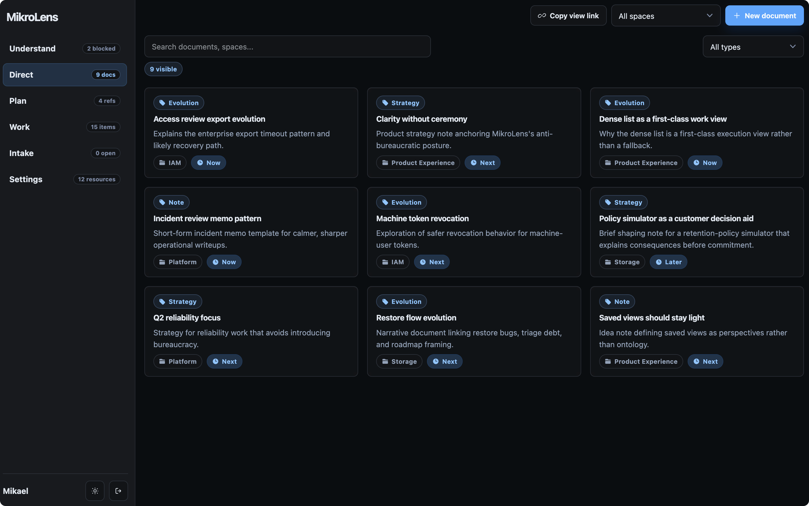
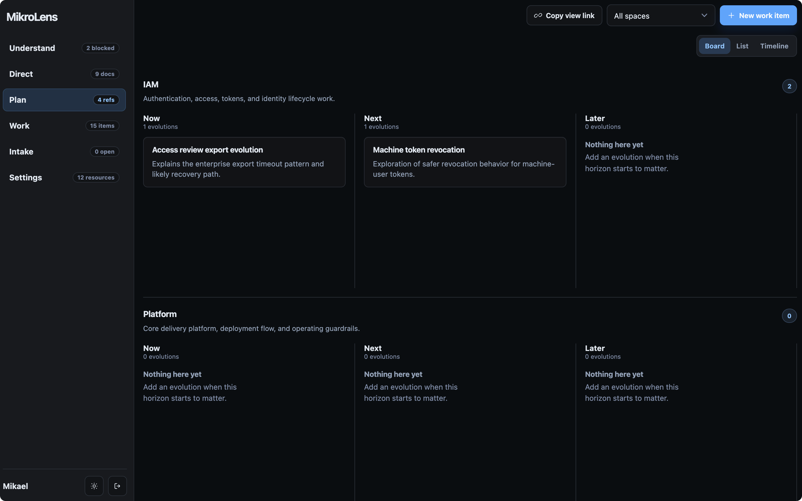
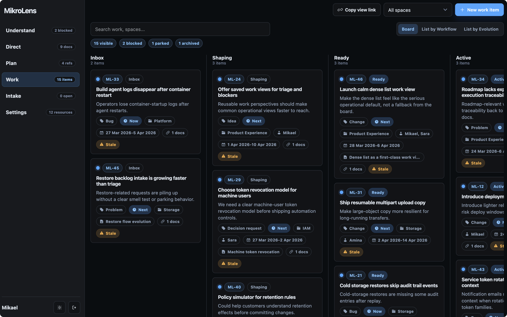
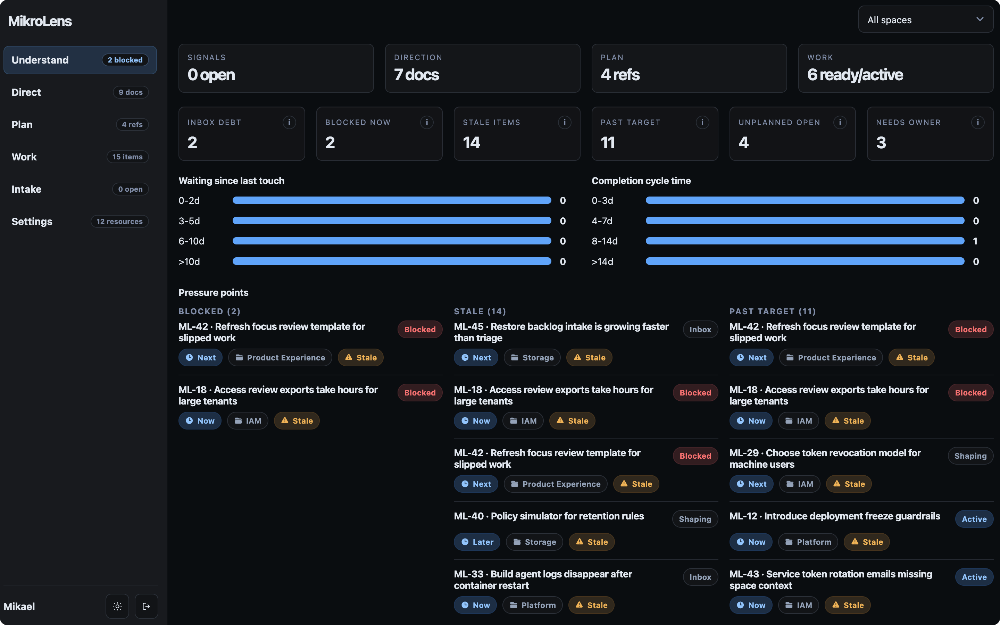

MikroLens is organized around the product work loop: capture what is coming in, decide what matters, write the direction, place the work, and keep the system healthy.

The views are not separate products. They are different surfaces over the same product chain.

## Spaces

Create a Space for each team, product area, domain, or initiative that needs its own planning surface.

Most work and documents belong to a Space. This keeps product context close to the team or area that can act on it.

Each Space has three planning horizons. The default labels are Now, Next, and Later. Settings lets you change those labels globally or override the wording for a specific Space.

## Intake

Use Intake for signals that may matter but are not ready to become owned work. These can be customer requests, support patterns, sales notes, internal asks, market observations, or product ideas.

Intake is intentionally lightweight. It should help the team collect evidence without pretending every incoming signal is already a commitment.

When a signal is worth shaping, pull it into a Space. MikroLens creates an unplanned Idea in that Space's Inbox and marks the original intake record as Pulled.

## Direct

Use Direct for narrative product work:

- **Strategy** for direction, intent, priorities, and tradeoffs.
- **Evolution** for product or system changes that need a storyline.
- **Note** for useful context that does not need a stronger type.

Documents are where product managers can do the strategic and directional work that does not fit inside a ticket. Link documents to work items so execution keeps its context.

## Plan

Use Plan to place work across Now, Next, and Later.

The board view is good for shaping and horizon planning. List and timeline views are useful when dates, spaces, or horizon grouping matter more.

Plan is not a separate roadmap database. It is a planning view over the same work items, documents, and horizons used by the rest of MikroLens.

## Work

Use Work for execution. Work items move through Inbox, Shaping, Ready, Active, Blocked, Parked, Waiting, Done, and Archived.

Keep work item summaries compact. When the reasoning needs room, link a Direct document instead of turning the work item into a mini-spec.

This keeps tickets from becoming the only place where product thinking happens.

## Understand

Use Understand to see the health of the product system:

- blocked work;
- stale work;
- intake debt;
- items past target;
- unplanned open work;
- items missing owners.

Understand is a team clarity view. It is not a scorecard for individuals. Check it when planning starts to feel noisy, when blockers linger, or when the Inbox grows faster than the team can clarify it.
